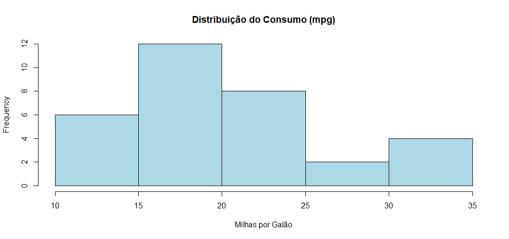
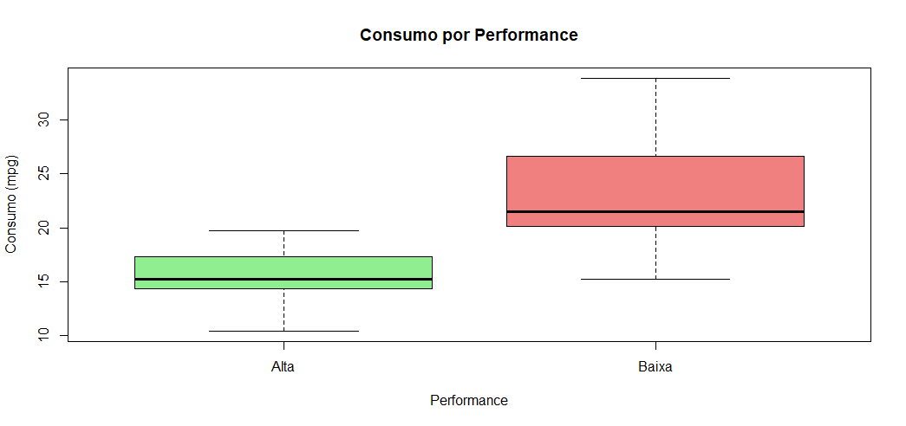
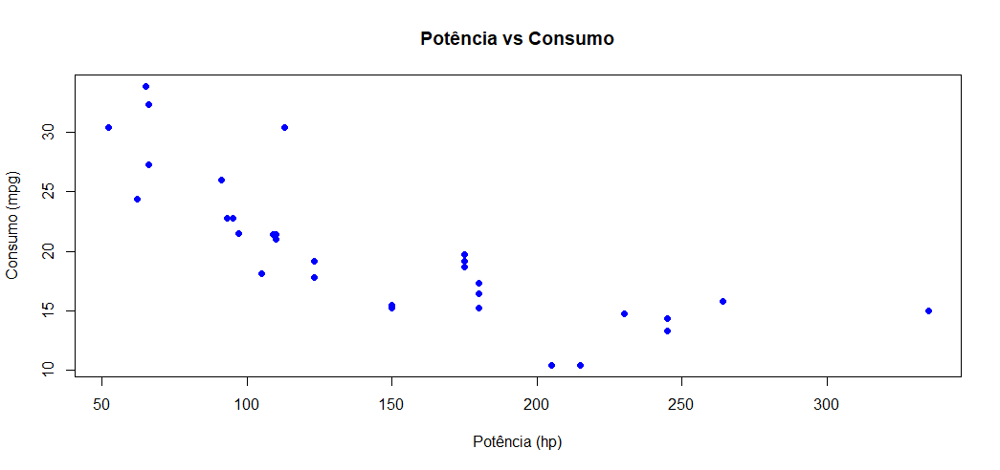

# R-mtcars
Análise de Dados de um Conjunto de Dados sobre Carros em R

## Visualização dos dados:

### Histograma do consumo de combustível

### Boxplot para comparar performance alta/baixa em relação ao consumo

### Gráfico de dispersão da potência vs consumo
